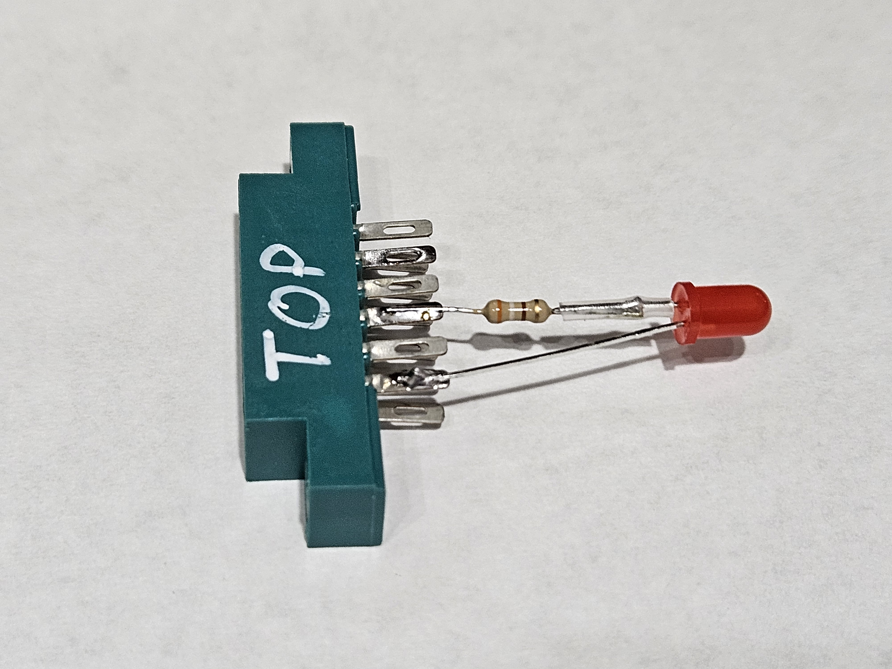

# DesTestMini

A tiny ROM-based diagnostic for the C64 that affords the best opportunity to see if at least the processor is executing instructions.

## Why
A C64 might show a black screen for many reasons.  Knowing where to start can be a little daunting.  Try this first.

This small diagnostic can be used to determine if at least the CPU is running, and that's a good start.
No assumptions are made about the state of the machine: The ROMs, RAM, CIAs, Colour RAM and SID need not be present.

## Building
This project was written in a Linux environment but should be relatively simple to adapt to other environments.  You
will need a 6502 assembler that can create a ROM-image (sometimes known as a raw image).  The Makefile is configured
to use `dasm`, an excellent assembler written by Matt Dillon in the '80s.  A modern dasm implementation can be found at
https://dasm-assembler.github.io/.  Any 6502 assembler that supports macros should work with only trivial changes to the source.
The supplied `Makefile` builds 4 variants of the ROM executable plus an extra 4 variants that can be used with VICE.
Simply run `Make` and you should end up with the eight build variants:

     8192 Sep 14 23:01 destestmini-nosid.rom  
    16384 Sep 14 23:01 destestmini-nosid_vice.rom  
     8192 Sep 14 23:01 destestmini-novic-nosid.rom  
    16384 Sep 14 23:01 destestmini-novic-nosid_vice.rom  
     8192 Sep 14 23:01 destestmini-novic.rom  
    16384 Sep 14 23:01 destestmini-novic_vice.rom  
     8192 Sep 14 23:01 destestmini.rom  
    16384 Sep 14 23:01 destestmini_vice.rom  

The 4 smaller variants should be exactly 8192 bytes each and the longer `_vice.rom` variants should be 16384 bytes each.
If your sizes do not match then the ROM will almost certainly not work.

The `Makefile` also contains rules which allow testing the resulting binaries with VICE (using the `_vice.rom` variants which are simply two copies of each binary one-after-the-other.  VICE doesn't seem to allow 8K MAX mode ROMs, but your
C64 certainly does):  
`make test` will test the default variant.  You should hear sound and see the screen flash.  
`make test-novic` will test the `-novic` variant.  You'll hear sound, but the screen will be blank.  
`make test-nosid` will test the `-nosid` variant.  The screen will flash but there will be no sound.  
`make test-novic-nosid`  will test the `-novic-nosid` variant.  The screen will not flash and there is no sound.  This is not an exciting test.

## MAX mode
For this diagnostic to work the resulting binary will be burned on to an EPROM (or equivalent) and put into a
standard C64 cartridge which is configured for MAX mode.

A MAX mode cartridge allows the code on the EPROM to be executed as soon as the machine is powered on.  This is
extremely useful for diagnostics cartridges since it means that it can bypass the normal initialization routines
that could fail in the face of faulty hardware.

Naturally you will need to program an EPROM with one of the 8192 bytes `.rom` images. The specifics of programming your EPROM depend on your programmer and the specifics of the cartridge you intend to make.

Bare C64 cartridges and pcb designs (such as the VersaCart) can easily be found on the internet and can likely be
ordered directly from the larger PCB manufacturers (on their Shared Projects or equivalent page).

Configure your new cartridge to MAX mode by ensuring that the /GAME signal is grounded (set to 0) and that the EPROM is
attached as /ROMH.

## How
The 6510 in your '64 connects to the cassette write and cassette-motor signal almost directly.  This arrangement offers
a great oppprtunity to see if the CPU is running while not relying on too many of the other components.

The code presented here continuously toggles the cassette-write and cassette-motor signals on for 1 second then off for
1 second. That's it.

If you have a 1530/C2N datassette then simply attatch it, plug in your new cartridge, power on your C64 and press PLAY.
No cassette is necessary.  If the cassette drive sprocket spins for a second then stops for a second repeatedly then
your C64 is indeed executing instructions.

If you don't have a datassette then you can probe the cassette interface directly with a multimeter.  Measure the
voltage between the GND (left most conductor when looking from behind, top or bottom) and WRITE (second conductor
from the right when looking from behind, top or bottom). If the voltage swaps between 0 volts and about 5 volts each
for 1 second repeatedly then your C64 is executing instructions.

#### LED
Alternatively you can attach and LED and 390R resistor between the GND and MOTOR conductors.  The LED has to be
attached between the GND and MOTOR conductors in the correct polarity.  The cathode (short-leg, flat-side) of
the LED should attach to the GND conductor and the anode (long-leg) of the LED should attach via the resistor
to the MOTOR conductor.
Note 1: the resistor can attach to either the cathode or anode.
Note 2: the WRITE signal can also be used however it is connected directly to the 6510 and won't supply as
        much current to light the LED.
Note 3: The value for the resistor (390R) should work for most red LEDs, but can be substitued as necessary
for different LEDs.  The voltage of the MOTOR signal is about 10V with no load.

    1 2 3 4 5 6   C64 cassette-port (viewed from the rear)
    -----------  
    A B C D E F   The top and bottom conductors carry the same signals.  

    F-6 SENSE   x  
    E-5 WRITE   x  
    D-4 READ    x   390R  
    C-3 MOTOR   o--/\/\/\----|  
    B-2 +5V     x   | /|     |  
    A-1 GND     o---|< |-----|  
                  - | \| +  
                     LED  

You can use small crocodile or alligator clip to attach to the GND and WRITE, just be sure to only touch the
copper trace (top and bottom) of the signal you are after.

If you wish to make your LED fixture more permanent you can buy a 6-pin 0.156-inch edge connector from your
favourite online electronic components retailer. Simply solder the LED/resistor to the appropriate pins on
the edge connector.  Be sure to clearly write the word "TOP" on your new fixture as plugging it in upside-down
may cause damage to your 6510.
  

### VIC-II
The option exists to enable flashing the VIC screen as a visual indication that the CPU is running.  This may not always be reliable as it is possible that some bad components (address bus muxes) can block the CPU from reaching the VIC to change the screen colour.

### SID
The option also exists to have the SID emit alternating tones as a sonic indication that the CPU is running.  SID chips are not the most reliable of ICs so not hearing anything isn't necessarily and indication of the CPU not running.
